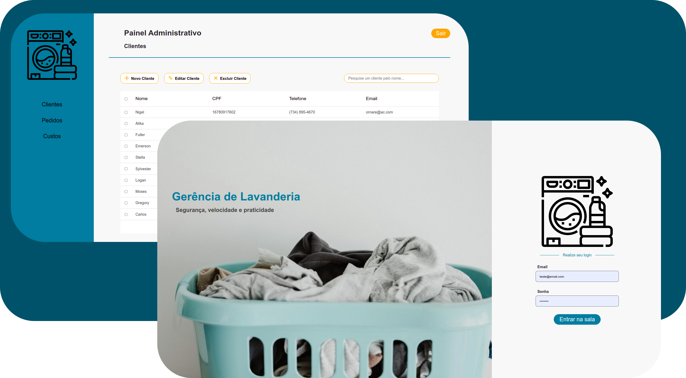

# Basic_Laundry_System

[](https://github.com/GabrielFSSantos/Basic_Laundry_System/blob/main/LICENSE)

<h1 align="center">
    
</h1>

### Este repositório é referente ao front-end da aplicação.

> :wrench:  Projeto criado para estudar e praticar conhecimentos de programação e para fins didáticos. <br><br>
> :books: Basic Laundry System vai lhe ajudar a gerenciar a sua lavanderia de forma mais rápida e efetiva. O mesmo conta com passibilidade de gerenciamento de clientes, pedidos e custos com adicional de entrega.<br><br>
> :busts_in_silhouette: Meus agradecimentos a [Samira Freitas](https://github.com/SamiraFreitas) que realizou o desenvolvimento de todo design e protótipo do projeto, como também contribuiu no desenvolvimento em React do mesmo.

## Layout

>🔖 Você pode visualizar o layout do projeto através do link abaixo:
>
>- [Layout Web](https://www.figma.com/file/rdFc8096UUnOuOpaaSLerv/Lavanderia) 
>
>Lembrando que você precisa ter uma conta no [Figma](http://figma.com/).


## Requirements
>Ter instalado pelo menos um gerenciador de pacotes do Node, [Npm](https://www.npmjs.com/) ou [Yarn](https://yarnpkg.com/).

## Installing

>Executar na raiz do projeto o seguinte comando para instalar as dependências
```sh
yarn install
```
>ou
```sh
npm install
```

## Use <a name="usage"></a>
```sh
yarn start
```

## Contributing
> :information_desk_person: O projeto é de livre acesso e uso, então fique à-vontade para realizar um Fork e utilizar do mesmo, como também sugerir dicas e melhorias.
> 
>  1. Faça um **fork** do projeto.
> 2. Crie uma nova branch com as suas alterações: `git checkout -b my-feature`
> 3. Salve as alterações e crie uma mensagem de commit contando o que você fez: `git commit -m "feature: My new feature"`
> 4. Envie as suas alterações: `git push origin my-feature`
> Caso tenha alguma dúvida confira este [guia de como contribuir no GitHub](https://github.com/firstcontributions/first-contributions)

## Tech
> :space_invader: Softwares e tecnologias utilizadas para o desenvolvimento e uso do projeto:
>
* [React] - Ferramenta utilizada para o desenvolvimento front-end.
* [Node.js] - Ferramenta base utilizada para o desenvolvimento geral.
* [Typescript] - Ferramenta de tipagem utilizada para o desenvolvimento geral.
* [VSCode] - Ótimo editor de texto.
* [StackEdit] - Excelente editor de Markdown online.

## License
[MIT License](https://github.com/GabrielFSSantos/Basic_Laundry_System/blob/master/LICENSE)

[React]: <https://reactjs.org>
[Node.js]: <https://nodejs.org/>
[Typescript]: <https://www.typescriptlang.org/>
[VSCode]: <https://code.visualstudio.com/>
[StackEdit]: <https://stackedit.io/>
